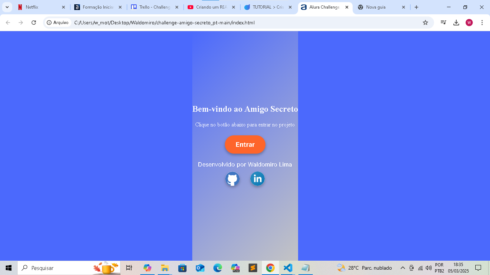
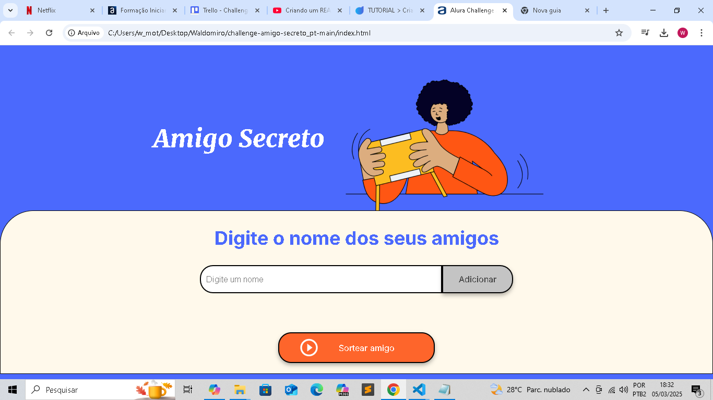

# Projeto Amigo Secreto

Um Sorteio do Amigo Secreto feito pela Alura com 💛

## Índice
- <a href="#funcionalidades">Funcionalidades do Projeto</a>
- <a href="#layout">Layout</a>
- <a href="#demonstracao">Demonstração</a>
- <a href="#tecnologias">Tecnologias utilizadas</a>
- <a href="#autor">Pessoa Autora</a>
- <a href="#passos">Próximos Passos</a>

## 📱Funcionalidades do Projeto

- [x]Entrar no Projeto
- [x]Armazenar Amigos
- [x]Agregar Amigos
- [x]Listar Amigos
- [x]Sortear Amigos
- [x]Válidar Nome
- [x]Lista de Amigos Vazia

## ⊞ Layout

## Demonstração
[Link demonstração](file:///C:/Users/w_mot/Desktop/challenge-amigo-secreto_pt-main/index.html)

## 🛠Tecnologias Utilizadas
1. [Challenge ONE Amigo Secreto Trello](https://trello.com/b/pKFrkRfb/trello-challenge-amigo-secreto-pt)
2. [Lógica de Programação: mergulhe em programação com JavaScript](https://cursos.alura.com.br/course/logica-programacao-mergulhe-programacao-javascript)
3. [Lógica de Programação: explore funções e listas](https://cursos.alura.com.br/course/logica-programacao-funcoes-listas)
4. [ChatGPT: otimizando a qualidade dos resultados](https://cursos.alura.com.br/course/chatgpt-otimizando-qualidade-resultados)
5. [Git e GitHub: compartilhando e colaborando em projetos](https://cursos.alura.com.br/course/git-github-compartilhando-colaborando-projetos)

## 🧑Pessoa Autora

[Linkedin](https://www.linkedin.com/in/waldomiro-lima-motta-66b3a122a/)

## 👞Próximo Passo

- [ ] Avançar na Formação 